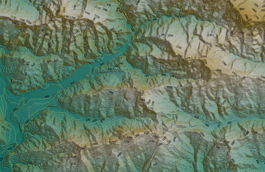

# Creating contour lines from STRM and ALOS DEMs in Google Earth Engine

## Making contour lines in Google Earth Engine
A contour line is that line that on a map joins all the points that have equal conditions and altitude. Contour lines are usually printed on maps in sienna for terrain and blue for glaciers and the deep sea.

</img>

These contour lines are an important way to show the rise and fall of the land on a map. Contour lines show all places that are at the same height above sea level. They also tell us about the slope of the land. On a steep slope, the lines are close together.

Contour lines are the most distinctive feature of a topographic map. Contour lines are lines drawn on a map that connect points of equal elevation, which means that if you physically followed a contour line, the elevation would remain constant. Contour lines show the elevation and shape of the terrain.

**Google Earth Engine** is a platform for scientific analysis and visualization of geospatial data sets, for academic, non-profit, commercial and government users. Earth Engine hosts satellite images and stores them in a public data archive that includes historical images of the Earth dating back more than forty years. The Google Earth Engine API provides a library of functions that can generate level lines from the global digital models available from the [**ALOS**](https://www.eorc.jaxa.jp/ALOS/en/aw3d30/index.htm) and [**STRM**](https://www2.jpl.nasa.gov/srtm/) projects.

Here you will find the complete code: [link](src='./JS/countour_lines_ALOS_STRM.js')

https://github.com/Alexanderariza/contour_lines_GEE/blob/main/JS/countour_lines_ALOS_STRM.js
